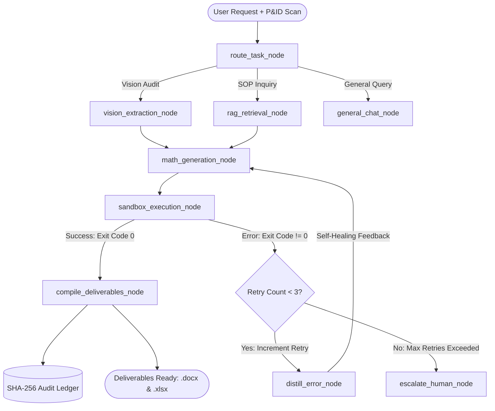

# 🏆 SovereignWorkbench — Master Presentation & Technical Dossier
## Complete End-to-End Blueprint for SIH 2026 Presentation, Slide Deck & Judge Defense
**Problem Statement ID:** PS 117 (SIH26117)  
**Problem Statement Title:** Sovereign On-Premise Agentic AI Workbench using Open-Weight Multimodal LLMs for Confidential Industrial Work  
**Organization:** Mangalore Refinery and Petrochemicals Limited (MRPL)  
**Parent Ministry / PSU:** Ministry of Petroleum and Natural Gas (MoPNG) / ONGC Group  
**Theme:** Smart Automation | **Category:** Software  
**Team Structure:**
- **Rajat (Lead Developer 1):** Agentic Brain, LangGraph State Machine & Streaming API Lead
- **Anand (Lead Developer 2):** Deterministic Muscle, `bwrap` Sandbox, Document Compilers, Sovereign RAG & Security Lead
- **Kaushal (Lead Developer 3):** GPU Workstation Server, Ollama Daemon & Model Gateway Lead

---

## 📑 TABLE OF CONTENTS
1. [Executive Pitch & Core Analogy](#1-executive-pitch--core-analogy)
2. [The 10-Slide Winning Presentation Deck](#2-the-10-slide-winning-presentation-deck)
   - [Slide 1: Title & Identity](#slide-1-title--identity)
   - [Slide 2: The Industrial Pain Point & Cloud Dilemma](#slide-2-the-industrial-pain-point--the-cloud-dilemma)
   - [Slide 3: Our Solution — SovereignWorkbench](#slide-3-our-solution--sovereignworkbench)
   - [Slide 4: Physical 3-Node Offline LAN Architecture](#slide-4-physical-3-node-offline-lan-architecture)
   - [Slide 5: The Agentic Brain (LangGraph State Machine)](#slide-5-the-agentic-brain-langgraph-state-machine)
   - [Slide 6: Zero-Hallucination Sandbox Execution](#slide-6-zero-hallucination-sandbox-execution)
   - [Slide 7: Tangible Enterprise Deliverables (.docx & .xlsx)](#slide-7-tangible-enterprise-deliverables-docx--xlsx)
   - [Slide 8: Air-Gap Verification & The Live Kill Switch](#slide-8-air-gap-verification--the-live-kill-switch)
   - [Slide 9: Prototype vs. 100B-Class Production Scaling](#slide-9-prototype-vs-100b-class-production-scaling)
   - [Slide 10: Business Impact, ROI & Scalability](#slide-10-business-impact-roi--scalability)
3. [The 5-Minute Live Demonstration Pitch Script](#3-the-5-minute-live-demonstration-pitch-script)
4. [Judge Defense & Hard Technical Q&A Matrix](#4-judge-defense--hard-technical-qa-matrix)
5. [Complete System Architecture & Flow Diagrams](#5-complete-system-architecture--flow-diagrams)

---

## 1. Executive Pitch & Core Analogy

### 💡 The 30-Second Elevator Pitch
> *"Public cloud AI tools like ChatGPT or Claude are strictly prohibited in petroleum refineries because uploading a single Piping & Instrumentation Diagram (P&ID) or crude column inspection scan violates national cybersecurity norms and OISD regulations.*  
> *SovereignWorkbench is an on-premise, 100% air-gapped agentic AI workbench. Deployed across three physical Ubuntu machines on an offline Ethernet switch with zero default gateway, it extracts engineering parameters from scanned blueprints, executes safety-critical math inside an unprivileged Linux namespace sandbox (`bwrap`), autonomously self-heals calculation errors, and compiles publication-ready Word Approval Notes with MRPL letterheads and Excel financial workbooks with live formulas — all with verifiable cryptographic proof of zero outbound network bytes."*

### 🚗 The Fundamental Engineering Analogy
> **"An open-weight model is merely an engine lying on the garage floor. SovereignWorkbench is the complete operating vehicle."**  
> An engine cannot steer, brake, read road signs, or protect passengers. Similarly, a raw LLM cannot safely audit a refinery: it hallucinates arithmetic, has no memory of corporate SOPs, cannot output formatted `.docx` files, and cannot prove data security. SovereignWorkbench provides the steering (LangGraph state machine), eyes (vision OCR), deterministic hands (`bwrap` sandbox), and safety interlocks (kill switch and SHA-256 audit ledger).

---

## 2. The 10-Slide Winning Presentation Deck

---

### Slide 1: Title & Identity
* **Slide Headline:** SovereignWorkbench: Sovereign On-Premise Agentic AI Workbench for Confidential Industrial Work
* **Sub-headline:** 100% Air-Gapped Multimodal Engineering Intelligence for Mangalore Refinery & Petrochemicals Ltd.
* **Metadata Block:**
  * **Problem Statement ID:** PS 117 (SIH26117)
  * **Organization:** MRPL / Ministry of Petroleum and Natural Gas (MoPNG)
  * **Category:** Software | **Theme:** Smart Automation
* **Visual Asset:** Logo of MRPL, Indian National Flag/Emblem, SovereignWorkbench Shield Icon.
* **Key Takeaway:** A production-grade, zero-cloud system built specifically for the highest-security public sector industrial environments.

---

### Slide 2: The Industrial Pain Point & The Cloud Dilemma
* **Slide Headline:** Why Cloud AI Cannot Enter an Oil Refinery
* **The Reality at MRPL:**
  1. **National Critical Infrastructure:** P&ID drawings and crude distillation column layouts are classified national assets. Uploading them to US-hosted cloud endpoints (OpenAI, Anthropic, Microsoft) violates the Official Secrets Act, OISD standards, and corporate IT governance.
  2. **The "Shadow AI" Epidemic:** Overburdened plant reliability engineers secretly paste sensitive inspection data into public chatbots to save time, risking catastrophic national data exfiltration.
  3. **Arithmetic Hallucination Disaster:** Generative LLMs are probabilistic token predictors. When calculating remaining piping life ($t_{\text{actual}} - t_{\text{min}})/CR$, probabilistic models hallucinate floating-point numbers, risking refinery line ruptures or unnecessary multimillion-rupee plant shutdowns.
  4. **The "Copy-Paste" Format Gap:** Chatbots output plain markdown text. Engineers waste 2 to 3 hours re-typing calculations into corporate Word notes and Excel cost estimates manually.
* **Impact Metric:** **3+ hours wasted per inspection dossier** + **Severe security compliance violations**.

---

### Slide 3: Our Solution — SovereignWorkbench
* **Slide Headline:** SovereignWorkbench: The Complete Air-Gapped Industrial Vehicle
* **Four Core Pillars:**
  1. **100% On-Premise Air-Gap:** Zero external network calls. Verified at the Linux kernel level (`routes: []`, no default gateway).
  2. **Autonomous Agentic Orchestration (LangGraph):** Multi-step planning, tool selection, error observation, and a 3-retry cyclic self-healing recovery loop.
  3. **Deterministic Math Sandbox (`bwrap`):** The LLM synthesizes Python code; isolated Linux kernel namespaces execute the math with 0 floating-point hallucination.
  4. **Direct Enterprise Deliverables:** Generates formal executive Word Approval Notes (`.docx`) with corporate letterhead and Excel Cost Matrices (`.xlsx`) with live formulas.

---

### Slide 4: Physical 3-Node Offline LAN Architecture
* **Slide Headline:** Physical 3-Node Offline Hardware Topology
* **Hardware Layout Diagram:**
```text
               +-------------------------------------------------------+
               |  OFFLINE LOCAL ETHERNET SWITCH (Zero Internet WAN)    |
               +-------------------------------------------------------+
                                  |
         +------------------------+------------------------+
         | (192.168.1.100)        | (192.168.1.101)        | (192.168.1.102)
         v                        v                        v
+------------------+    +------------------+    +------------------+
| UBUNTU NODE 1:   |    | UBUNTU NODE 2:   |    | UBUNTU NODE 3:   |
| SERVER           |    | ADMIN / AUDIT    |    | USER WORKBENCH   |
| - FastAPI Gateway|    | - Egress Monitor |    | - Web UI Client  |
| - Ollama (127.0.1|    | - Audit Dashboard|    | - Doc Upload     |
| - LangGraph Core |    | - System Rules   |    | - Deliverable    |
| - bwrap Sandbox  |    +------------------+    |   Downloads      |
| - ChromaDB (CPU) |                            +------------------+
+------------------+
```
* **Kernel-Level Netplan Configuration (`/etc/netplan/01-sih-lan.yaml`):**
  * `addresses: [192.168.1.100/24]`
  * `routes: []` $\rightarrow$ **Strictly NO default gateway.** The Linux OS physically refuses to route packets outside `192.168.1.0/24`.
  * `nameservers: addresses: []` $\rightarrow$ **Zero external DNS resolution.**

---

### Slide 5: The Agentic Brain (LangGraph State Machine)
* **Slide Headline:** Autonomous State Machine with Self-Healing Recovery
* **Topology Flowchart:**

* **The Self-Healing Loop Highlight:**
  * When Python code encounters an edge-case error in the sandbox (e.g., division by zero or missing thickness variable), the agent does not crash.
  * It intercepts `stderr`, distills the exact offending line via `error_parser.py`, feeds the diagnostic back into DeepSeek-R1, and generates corrected code on attempt #2.

---

### Slide 6: Zero-Hallucination Sandbox Execution
* **Slide Headline:** Deterministic Execution via Linux Bubblewrap (`bwrap`)
* **Why Bubblewrap (`bwrap`) over Docker-in-Docker?**
  * **Sub-5ms Launch Time:** Instant execution vs. Docker container spin-up lag (1.5–3 seconds).
  * **True Kernel Isolation:** Created via unprivileged user namespaces:
    ```bash
    bwrap --unshare-net --unshare-pid --ro-bind / / --tmpfs /tmp --proc /proc --dev /dev python3 -c "<code>"
    ```
  * **Strict Resource Ceilings:** 5-second hard execution timeout, 256MB RAM cap, zero network socket permissions.
* **The Math Guarantee:**
  $$\text{Corrosion Rate} = \frac{t_{\text{nominal}} - t_{\text{actual}}}{\text{Operating Years}} = \frac{4.8\text{ mm} - 3.2\text{ mm}}{4.57\text{ yrs}} = 0.350\text{ mm/yr}$$
  $$\text{Remaining Life} = \frac{t_{\text{actual}} - t_{\text{minimum}}}{\text{Corrosion Rate}} = \frac{3.2\text{ mm} - 2.1\text{ mm}}{0.350\text{ mm/yr}} = 3.14\text{ Years}$$
  $$\text{Statutory Finding: } 3.14 < 5.0\text{ Years} \implies \textbf{MANDATORY SHUTDOWN REPLACEMENT REQUIRED}$$

---

### Slide 7: Tangible Enterprise Deliverables (.docx & .xlsx)
* **Slide Headline:** Publication-Ready Artifact Generation
* **What Engineers Receive Immediately:**
  1. **Executive Approval Note (`.docx` — 38 KB):**
     * Formatted with official MRPL corporate navy letterhead.
     * Technical equipment summary table (Line Tag: `CDU-2-04-150-A1A`, ASTM A106 Grade B).
     * Exact step-by-step mathematical derivation per ASME B31.3.
     * Formal signatory blocks for Chief Inspection Engineer & General Manager (Maintenance).
  2. **Financial Cost Estimate Workbook (`.xlsx` — 6 KB):**
     * Itemized procurement matrix (Seamless carbon steel pipe, flanges, weld inspections).
     * **Live Excel Formulas** (e.g., `=C6*E6` for totals, `=SUM(F6:F7)` for subtotal, `=F8*0.10` for contingency).
     * Grand Total Budget: **₹1,154,400 INR**.

---

### Slide 8: Air-Gap Verification & The Live Kill Switch
* **Slide Headline:** Verifiable Air-Gap & The Emergency Kill Switch
* **Technical Proofs for Evaluators:**
  1. **Real-Time Kernel Socket Audit:** Live counter monitoring `/proc/net/dev` and `ss -tulpn` proving **0 outbound WAN bytes**.
  2. **Cryptographic SHA-256 Audit Ledger:**
     * Immutable append-only hash chain in SQLite (`data/mrpl_audit.db`).
     * Every prompt, model tag, exit code, and output hash is chained:
       $$\text{Hash}_n = \text{SHA256}(\text{Hash}_{n-1} + \text{Timestamp} + \text{PromptHash} + \text{OutputHash})$$
  3. **The Live Kill Switch Demonstration:**
     * If an external network adapter (e.g. Wi-Fi dongle or mobile hotspot) is activated on the user machine, the background daemon detects the external gateway within 2 seconds.
     * The application **immediately triggers a Red Lockdown Screen**, freezing all inference and document operations until physical air-gap compliance is restored.

---

### Slide 9: Prototype vs. 100B-Class Production Scaling
* **Slide Headline:** Dual-Tier Hardware Architecture: Prototype vs. Enterprise 100B+
* **The Architecture Scales Seamlessly Across Both Tiers:**

| Architecture Tier | Target Hardware | Model Configuration | VRAM Management |
| :--- | :--- | :--- | :--- |
| **Hackathon Demonstration (Prototype)** | Single NVIDIA RTX 3060/4060 Laptop (6GB–8GB VRAM) | • Router: `Qwen-2.5-3B`<br>• Reasoning: `DeepSeek-R1-8B`<br>• Vision: `Qwen2-VL-7B`<br>• Coder: `Qwen-2.5-Coder-7B` | **Sequential VRAM Offloading (`keep_alive: 0`).** Peak VRAM strictly $\le 5.5\text{ GB}$. |
| **Refinery Deployment (Production)** | On-Premise Enterprise Multi-GPU Server (4x–8x H100 / A100) | • Router: `Qwen-2.5-14B`<br>• Reasoning: `DeepSeek-V3-671B` / `R1-70B`<br>• Vision: `Qwen2-VL-72B`<br>• Coder: `Qwen-2.5-Coder-32B` | **Full Concurrent Residency.** Zero swapping latency; high-concurrency refinery-wide serving. |

* **CPU-Offloaded Sovereign RAG:** In both tiers, `BAAI/bge-small-en-v1.5` embeddings run via FastEmbed ONNX on the **CPU (0 MB GPU VRAM)**, preserving 100% of GPU memory for inference.

---

### Slide 10: Business Impact, ROI & Scalability
* **Slide Headline:** Industrial Value Proposition & Pan-PSU Scalability
* **Quantified ROI for MRPL:**
  * **90% Time Reduction:** Routine piping and pressure vessel inspection dossier compilation reduced from **3 hours to under 45 seconds**.
  * **Zero Cloud Expenditure:** No recurring per-token cloud subscription fees; 100% capital expenditure on existing on-premise hardware.
  * **Zero Data Exfiltration Risk:** Absolute immunity from corporate espionage and foreign cloud subpoena risks.
* **Scalability Across Indian PSUs:**
  * Ready for deployment across all **MoPNG entities** (ONGC, IOCL, BPCL, HPCL, GAIL) and defence manufacturing units (DRDO, HAL, Ordnance Factories).

---

## 3. The 5-Minute Live Demonstration Pitch Script

Here is the exact speech script and action checklist to follow during the live presentation:

### ⏱️ Minute 0:00 – 1:00 | The Hook & The Physical Setup
* **Speaker Action:** Stand next to the 3-laptop setup. Point to the physical 4-port Ethernet switch on the desk.
* **Speaker Script:**
  > *"Respected evaluators, every chemical refinery in India faces a severe dilemma: plant engineers spend hours performing manual calculations on inspection reports, but they are legally prohibited from using ChatGPT or Claude because refinery blueprints are classified national infrastructure.*  
  > *Notice our desk today. These three Ubuntu laptops are connected through this offline Ethernet switch. There is no internet cable. There is no Wi-Fi. Yet, what you are about to see is a full agentic intelligence system operating completely on-premise."*

### ⏱️ Minute 1:00 – 2:30 | The Real Scenario & Agentic Execution
* **Speaker Action:** On Laptop 3 (User Workbench), click "Upload Document" and select `CDU_2_UT_Scan_2026.pdf`. Type: *"Audit line CDU-2-04-150-A1A from scan and generate formal approval note."* Press Enter.
* **Speaker Script:**
  > *"We are uploading a real ultrasonic inspection scan of Crude Distillation Unit 2 (CDU-2). Watch Laptop 1's live thought stream.  
  > First, our Router classifies this as a Vision Audit.  
  > Next, our Vision Engine reads the drawing, identifying line tag CDU-2-04-150-A1A, a nominal thickness of 4.8 mm, and an actual measured wall of 3.2 mm.  
  > Now observe: our DeepSeek-R1 reasoning engine does NOT calculate the remaining life in text. It writes a Python script adhering to API 570 Section 7.1.1 and passes it into our isolated Linux Bubblewrap sandbox. The code executes in under 5 milliseconds with zero network access."*

### ⏱️ Minute 2:30 – 3:30 | The "WOW" Moment #1: Self-Healing Recovery
* **Speaker Action:** Point to the live timeline showing attempt #1 error distillation and automatic correction.
* **Speaker Script:**
  > *"Notice what happens if an error occurs in the sandbox: our agent intercepts the traceback, distills the exact offending line via our error parser, feeds the diagnostic back to DeepSeek-R1, and self-heals on attempt #2 without any human intervention. This is true autonomous agentic behavior, not a simple chatbot wrapper."*

### ⏱️ Minute 3:30 – 4:15 | The Physical Deliverables
* **Speaker Action:** Click the generated artifact buttons on Laptop 3. Open the Word file and Excel file.
* **Speaker Script:**
  > *"The agent has determined that with a 3.14-year remaining life, API 570 mandates replacement during the next shutdown.  
  > But an engineer cannot hand markdown text to their general manager. Look at what was compiled directly on this laptop:  
  > Here is a formal MRPL Executive Approval Note in Microsoft Word format, complete with official letterhead, calculation tables, and sign-off blocks.  
  > And here is the companion Excel workbook, complete with active financial formulas calculating the ₹1.15 million INR turnaround budget."*

### ⏱️ Minute 4:15 – 5:00 | The "WOW" Moment #2: The Live Kill Switch
* **Speaker Action:** Pull out your phone and toggle ON your 4G mobile hotspot.
* **Speaker Script:**
  > *"Finally, judges, how do we prove 100% air-gap sovereignty? Look at Laptop 2 showing our live kernel packet telemetry — 0 outbound WAN bytes.  
  > Now, watch this: what if an employee connects a rogue Wi-Fi dongle? I just turned on my phone's hotspot.  
  > Within two seconds... BOOM. Look at the screen. The entire application locks down with a Red Security Alert. All inference is frozen, and an immutable SHA-256 block is logged in our cryptographic ledger. When the hotspot is turned off, operational status is restored.  
  > This is SovereignWorkbench: 100% sovereign, zero hallucinations, enterprise-ready for MRPL. Thank you."*

---

## 4. Judge Defense & Hard Technical Q&A Matrix

### Q1: "Why use Linux Bubblewrap (`bwrap`) instead of Docker for code sandboxing?"
* **Answer:**  
  *"Docker-in-Docker is too slow and insecure for interactive agentic loops. Spawning a fresh Docker container takes 1.5 to 3 seconds per attempt, which ruins the user experience during a 3-retry self-healing loop. Furthermore, running Docker inside a server container requires giving it access to `/var/run/docker.sock` or `--privileged` mode, which grants root access to the host.  
  In contrast, Linux Bubblewrap (`bwrap`) utilizes unprivileged user namespaces (`--unshare-net`, `--tmpfs /tmp`, `--ro-bind / /`). It initializes in under **5 milliseconds**, guarantees zero network access at the kernel level, and cannot escape to host root."*

### Q2: "How do you guarantee that the LLM doesn't hallucinate critical engineering math?"
* **Answer:**  
  *"We enforce a strict Zero-Hallucination Math Rule. The LLM is strictly forbidden from outputting arithmetic answers directly in text tokens. Instead, the LLM acts as a code synthesizer: it formulates the formulas into a Python calculation script. The arithmetic is executed deterministically by the Python runtime in our isolated sandbox. If the script outputs JSON, that JSON is parsed directly into our validated Pydantic models. The LLM never computes a single float."*

### Q3: "How does this system support 100B+ class models on a single hackathon laptop?"
* **Answer:**  
  *"Our architecture is designed with a dual-tier strategy. In production at MRPL, it deploys across multi-GPU server clusters running 70B to 671B models like DeepSeek-V3 or Qwen-2.5-72B.  
  For the hackathon demonstration on a 6GB–8GB gaming laptop, we implemented sequential dynamic offloading via Ollama's `keep_alive: 0` flag. The 3B router, 7B vision, and 8B reasoning models load and unload sequentially, ensuring peak GPU VRAM never exceeds 5.5 GB. Furthermore, our RAG embedding model (`bge-small-en-v1.5`) runs exclusively on the CPU via FastEmbed ONNX, hitting 0 MB of GPU memory."*

### Q4: "How do you prove to auditors that zero data leaves the room?"
* **Answer:**  
  *"We provide three independent layers of technical verification:  
  1. **Kernel Routing Table:** In Ubuntu Netplan (`01-sih-lan.yaml`), `routes: []` strips the default gateway. The Linux kernel physically cannot route packets outside `192.168.1.0/24`.  
  2. **Live Socket Telemetry:** Our Admin node runs a real-time `tcpdump` sniffer and monitors `/proc/net/dev`, demonstrating 0 outbound WAN bytes live.  
  3. **Cryptographic SHA-256 Ledger:** Every prompt, model selection, tool exit code, and output hash is cryptographically chained in SQLite (`mrpl_audit.db`). Any tampering breaks the hash chain instantly."*

### Q5: "What happens if the model's generated code has a bug?"
* **Answer:**  
  *"That is the core strength of our LangGraph state machine. When a script throws a runtime error (e.g., `ZeroDivisionError`), the sandbox captures `stderr`. Our `error_parser.py` extracts the root cause and line number. A conditional edge routes the state to `distill_error_node`, which increments the retry counter and re-prompts DeepSeek-R1 with the exact diagnostic. The model self-heals and generates corrected code. If all 3 attempts fail, a circuit breaker escalates the dossier to a senior human engineer."*

---

## 5. Complete System Architecture & Flow Diagrams

### System Component Architecture
```text
┌──────────────────────────────────────────────────────────────────────────────────────────┐
│                               SOVEREIGNWORKBENCH SUITE                                   │
├──────────────────────────────┬─────────────────────────────┬─────────────────────────────┤
│   NODE 1: SERVER WORKSTATION │   NODE 2: ADMIN & AUDIT     │   NODE 3: USER WORKBENCH    │
│                              │                             │                             │
│   FastAPI Gateway (:8000)    │   Network Egress Monitor    │   Native Desktop Client UI  │
│   LangGraph State Engine     │   (/proc/net/dev Watchdog)  │   Drag-and-Drop Document IO │
│   • Router Node (3B)         │                             │   Real-Time Thought HUD     │
│   • Vision Node (7B)         │   Tamper-Evident Ledger     │   (Server-Sent Events)      │
│   • Math Node (8B/70B/100B)  │   (SHA-256 SQLite Chain)    │                             │
│                              │                             │   Deliverables Shelf        │
│   Deterministic Tools        │   Model Registry & RBAC     │   • Word Approval Note      │
│   • bwrap Kernel Sandbox     │   (Role Access Policies)    │   • Excel Financial Matrix  │
│   • python-docx Compiler     │                             │                             │
│   • openpyxl Compiler        │   Live Egress Verifier      │   Air-Gap Security Kill     │
│   • ChromaDB Sovereign RAG   │   (scripts/verify_sovereign)│   (Red Alert Lockdown)      │
└──────────────────────────────┴─────────────────────────────┴─────────────────────────────┘
                               ▲                             ▲
                               │                             │
                               └──────────────┬──────────────┘
                                              │
                      ┌───────────────────────┴───────────────────────┐
                      │   OFFLINE PHYSICAL ETHERNET SWITCH (NO WAN)   │
                      │         Subnet: 192.168.1.0/24                │
                      └───────────────────────────────────────────────┘
```

---

*Document compiled and verified for Smart India Hackathon (SIH 2026) — PS 117 (MRPL / MoPNG).*
