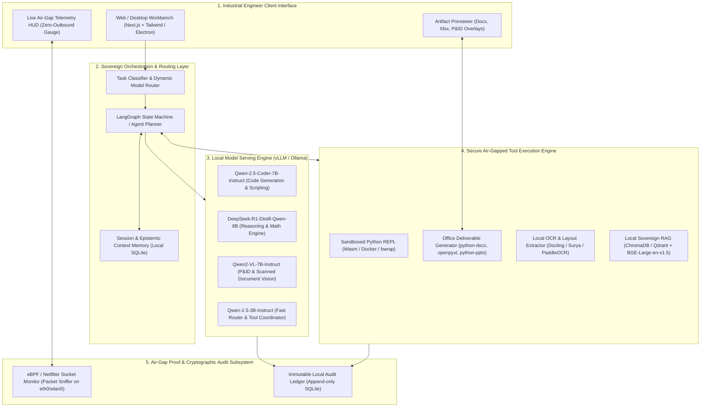

# SIH 2026 — Problem Statement 117 (SIH26117)
## Sovereign On-Premise Agentic AI Workbench using Open-Weight Multimodal LLMs for Confidential Industrial Work

---

## 1. Executive Summary & Quick Reference

| Field | Official Specification |
| :--- | :--- |
| **Problem Statement ID** | **SIH26117** (Short Code: **PS 117**) |
| **Problem Statement Title** | **Sovereign On-Premise Agentic AI Workbench using Open-Weight Multimodal LLMs for Confidential Industrial Work** |
| **Organization** | **Mangalore Refinery and Petrochemicals Limited (MRPL)** |
| **Ministry / Parent PSU** | **Ministry of Petroleum and Natural Gas (MoPNG) / ONGC Group** |
| **Category** | **Software** |
| **Theme** | **Smart Automation** |
| **Domain** | **Agentic AI • Sovereign LLMs • Air-Gapped Cybersecurity • Multimodal Industrial Document Automation** |
| **Target End-Users** | Refinery process engineers, safety inspectors, PSU executive committees, defence & manufacturing knowledge workers |
| **Dataset Requirement** | Public/synthetic industrial datasets (open P&IDs, sample scanned inspection PDFs, equipment logs). No proprietary data needed. |
| **SIH Classification** | **Tier 1 (High Impact, High Technical Depth, Winning Potential: 9.5/10)** |

---

## 2. Problem Dossier (Official SIH Specifications)

### 2.1 Background
Refineries, Public Sector Undertakings (PSUs), defence-linked manufacturing units, and government departments generate vast quantities of routine yet intensely sensitive knowledge work:
- Executive approval notes and ministerial dossiers
- Board presentations and confidential capital expenditure justifications
- Complex engineering calculations (thermodynamic, stress, corrosion analysis)
- Custom scripting and automation code for legacy internal control tools
- Review of scanned technical drawings (Piping & Instrumentation Diagrams - P&IDs, isometric sketches) and plant inspection reports

**The Critical Pain Point:**  
None of this data can be processed using public cloud AI assistants (such as OpenAI ChatGPT, Anthropic Claude, Microsoft Copilot, or GitHub Copilot) because the underlying assets are strictly classified:
- Critical national infrastructure layouts
- Piping & Instrumentation Diagrams (P&IDs)
- Financial bids, procurement negotiations, and vendor pricing matrices
- Unreleased chemical plant modifications and patentable designs
- Internal board correspondence and strategic business planning

**The Current Dilemma:**  
Company policy mandates that all data remains on-premises. As a consequence:
1. **Severe Productivity Bottleneck:** Engineers and officers execute tedious compliance, calculation, and document collation tasks manually.
2. **Shadow AI Security Risk:** Pressured employees covertly copy-paste confidential company snippets into public cloud LLMs, creating catastrophic data exfiltration risks.
3. **Absence of Usable On-Prem Solutions:** While open-weight reasoning models (DeepSeek-R1, Qwen 2.5, Llama 3.3) have matured exponentially, no turnkey, end-to-end deployable agentic workbench exists that industrial workers can use with the ease of Claude or Codex.

---

### 2.2 Official Problem Statement & Objective
The goal is to design, develop, and demonstrate a **self-hosted, 100% air-gapped AI workbench** running entirely on an organization's on-premise workstation or GPU server.

Key system attributes required by MRPL:
1. **Zero External Data Leakage:** Absolute zero bytes transmitted outside the local perimeter.
2. **Dynamic Multi-Model Auto-Selection:** The backend must not be locked into one monolithic model. It must intelligently route requests to specialized open-weight models based on task taxonomy (e.g., Code generation $\rightarrow$ Qwen-2.5-Coder; Complex reasoning & math $\rightarrow$ DeepSeek-R1; Visual drawings $\rightarrow$ Qwen2-VL).
3. **Pluggable & Future-Proof Model Architecture:** Support dropping in newer open-weight models as the open-source ecosystem advances without architectural overhauls.
4. **Autonomous Agentic Loop:** Iterative multi-step planning, tool selection, reflection, sandboxed execution, and self-correction instead of one-shot conversational replies.
5. **Multimodal Technical Document Parsing:** Capability to extract structured data from scanned PDFs, handwritten maintenance logs, P&ID engineering schematics, and equipment photos using local vision models and on-device OCR.
6. **Tangible Industrial Deliverables (Artifacts):** Direct output of formal Word approval notes (`.docx`), financial/risk spreadsheets (`.xlsx`), presentation decks (`.pptx`), and verified executable scripts with shown work.
7. **Sovereign Industrial RAG:** Local knowledge grounding against plant manuals, Standard Operating Procedures (SOPs), OISD (Oil Industry Safety Directorate) norms, and historical inspection databases without external cloud embeddings.
8. **Verifiable Air-Gap Telemetry:** Live network monitoring telemetry proving undeniable zero-outbound connectivity during all operations.

---

## 3. Core Problem vs. Proposed Solution Matrix

| Operational Dimension | Status Quo (Cloud AI / Manual Work) | Proposed Sovereign Agentic Workbench |
| :--- | :--- | :--- |
| **Data Residency & Security** | Data sent to third-party US/foreign cloud servers; violates PSU security policies & OISD guidelines. | **100% On-Premise & Air-Gapped.** Runs on local GPU/CPU; zero outbound packets verifiable via live kernel socket telemetry. |
| **Model Lock-in** | Single proprietary API (e.g., GPT-4o only or Claude 3.5 Sonnet only). High subscription cost and API deprecation risk. | **Dynamic Multi-Model Gateway.** Dynamically selects best-in-class open-weight models (Qwen-2.5, DeepSeek-R1, Qwen2-VL) with hot-plug support. |
| **Task Execution** | Chatbot interface; returns generic text suggestions; user must manually copy, paste, reformat, and test code. | **Autonomous Agentic Tool Execution.** Decomposes goals into DAG plans, calls local tools, executes Python in isolated sandboxes, and verifies results. |
| **Deliverable Quality** | Raw markdown or plain text requiring 2+ hours of manual document assembly. | **Native Enterprise Artifacts.** Generates publication-ready `.docx` approval notes with PSU letterheads, calculated `.xlsx` sheets, and executive `.pptx`. |
| **Multimodal Drawings** | Public vision APIs fail on dense, non-standard industrial diagrams and risk uploading facility blueprints. | **Local Industrial Vision & OCR Engine.** Local vision LLMs combined with bounding-box OCR (Docling/PaddleOCR) for P&ID schematics and handwritten logs. |
| **Domain Grounding** | Generic public web knowledge; hallucinated compliance rules. | **Air-Gapped Sovereign RAG.** Grounded in refinery SOPs, API 570/510 inspection standards, and plant correspondence using local vector embeddings. |
| **Audit & Compliance** | Zero explainability; opaque API logs stored on vendor infrastructure. | **Local Cryptographic Audit Trail.** Every reasoning step, code execution output, and tool call is timestamped and recorded in local SQLite logs. |

---

## 4. Technical Architecture



---

## 5. Model Routing & Resource Sizing Matrix

To guarantee smooth operation at hackathon venues and on industrial workstations, the architecture employs an adaptive quantization and multi-model routing strategy:

| Task Category | Primary Open-Weight Model | Quantization | Context Window | VRAM Footprint | Secondary / Fallback Model |
| :--- | :--- | :--- | :--- | :--- | :--- |
| **Task Classification & Routing** | Qwen-2.5-3B-Instruct | Q4_K_M (GGUF) | 8k tokens | ~2.2 GB | Regex + Semantic Router |
| **Industrial Math & Failure Analysis** | DeepSeek-R1-Distill-Qwen-8B | Q4_K_M / Q8_0 | 16k tokens | ~5.4 GB | Llama-3.1-8B-Instruct (Q4) |
| **Tool Scripting & Data Parsing** | Qwen-2.5-Coder-7B-Instruct | Q4_K_M (AWQ/GGUF) | 16k tokens | ~4.8 GB | DeepSeek-Coder-6.7B (Q4) |
| **P&ID Diagrams & Scanned Inspection** | Qwen2-VL-7B-Instruct | Q4_K_M | 8k tokens | ~5.2 GB | MiniCPM-V-2.6 (8-bit, ~4.5 GB) |
| **Local Text Embeddings (RAG)** | BAAI/bge-large-en-v1.5 | FP16 / ONNX | 512 tokens | ~1.2 GB | all-MiniLM-L6-v2 (~250 MB) |
| **Local OCR & Layout Detection** | Docling / Surya OCR | Local CPU/CUDA | N/A | ~1.5 GB | PaddleOCR / Tesseract 5 |

> **VRAM Optimization Insight:**  
> Using **Ollama** or **vLLM** with dynamic model offloading allows a mid-range consumer GPU (e.g., RTX 3060 12GB or RTX 4060 8GB + 16GB System RAM) to seamlessly run these models sequentially by holding the routing model in memory and swapping specialized models on demand in under 2 seconds.

---

## 6. Agentic Tool Registry & Capabilities

The workbench does not merely chat; it commands a suite of local, deterministic tools to deliver finished engineering artifacts:

| Tool Name | Subsystem | Inputs | Execution Environment | Deliverable / Output |
| :--- | :--- | :--- | :--- | :--- |
| `read_industrial_document` | Multimodal Ingestion | File path (PDF, PNG, JPG, TIFF) | On-device Docling + Qwen2-VL | Extracted text, tabular structures, identified valves, tag numbers, and structural notes. |
| `execute_sandboxed_python` | Computation & Code | Python code string, dataset path | Isolated sandbox (`bwrap` / local docker container) | Verified numerical calculations, corrosion rate curve plots, stress analysis logs. |
| `query_plant_knowledge_base` | Sovereign RAG | Natural language query, plant domain | Local ChromaDB + BGE Embeddings | Retrieved clauses from MRPL SOPs, API 510/570 standards, and past incident reports. |
| `generate_word_approval_note` | Deliverable Generator | JSON payload with headings, findings, approvers | `python-docx` template engine | Formatted `.docx` executive approval document with PSU header, tables, and signature blocks. |
| `generate_excel_cost_sheet` | Deliverable Generator | Financial/corrosion data array | `openpyxl` engine | Formatted `.xlsx` workbook with automated formulas, conditional formatting, and cost breakdown. |
| `generate_board_presentation` | Deliverable Generator | Key takeaways, summary bullets | `python-pptx` engine | Clean `.pptx` slide deck ready for plant management briefings. |
| `verify_airgap_status` | Security Telemetry | Sampling duration (seconds) | eBPF / `/proc/net/tcp` socket sniffer | JSON report confirming 0 outbound IP packets sent, active network interfaces, and socket states. |

---

## 7. Air-Gap Proof & Zero-Exfiltration Architecture

MRPL specifically highlighted in the problem statement:
> *"The system should also show, through logs or a visible network monitor, that no external calls are made at any point. That's the actual proof of the sovereign claim, not just a statement of it."*

### How We Deliver Irrefutable Proof:
1. **Live Network Telemetry Widget (HUD):**
   - A dedicated real-time telemetry panel embedded directly inside the workbench header.
   - Constantly polls local OS socket states via `/proc/net/dev` and `/proc/net/tcp` (or Linux `ss` / `netstat`).
   - Displays a live line chart of:
     - Outbound WAN Packets: **Strictly 0 B/s**
     - Outbound WAN Bytes: **0 Bytes Total**
     - Local IPC / Loopback Traffic: Active (displaying local communication between Next.js UI, FastAPI, and local vLLM/Ollama port `11434`).
2. **Deterministic Network Isolation (Sandboxing):**
   - Backend processes run under an isolated Linux network namespace (`ip netns`) or firewall restriction (`iptables -A OUTPUT -d 127.0.0.1 -j ACCEPT; iptables -A OUTPUT -j DROP`).
   - Any accidental third-party library attempt to phone home (e.g., HuggingFace telemetry, telemetry analytics) is blocked at the kernel boundary and flagged on the dashboard.
3. **Cryptographic Proof Log:**
   - Every session produces a verifiable audit hash with SHA-256 signatures of all ingested files, prompt records, and local socket logs.

---

## 8. Live Demonstration Script for Hackathon Judges

To ensure a maximum scoring impact during the SIH presentation, the demo follows a complete, high-stakes industrial scenario:

```
[SCENARIO: CRITICAL PIPE INSPECTION & MTR APPROVAL AT MRPL CRUDE DISTILLATION UNIT 2]
```

* **Step 1: Ingestion of Scanned Inspection Report & P&ID Drawing**
  - **Action:** User drags and drops a scanned, multi-page PDF containing a handwritten refinery wall-thickness inspection report and an accompanying P&ID schematic showing pipe line `CDU-2-04-150-A1A`.
  - **System Behavior:** Model router activates `Qwen2-VL` and `Docling`. The UI visualizes bounding boxes highlighting the pipe section, measured ultrasonic wall thickness (3.2 mm vs. minimum nominal 4.8 mm), and corrosion pitting notes.

* **Step 2: Autonomous Multi-Step Reasoning & Engineering Calculation**
  - **Action:** User prompts: *"Evaluate line CDU-2-04-150-A1A according to API 570 standards, calculate remaining service life and MAWP, and prepare a shutdown repair approval note."*
  - **System Behavior:**
    1. Agent switches to `DeepSeek-R1` for reasoning.
    2. Agent queries `query_plant_knowledge_base` to retrieve corrosion allowance formulas and material yield specs.
    3. Agent writes Python code to compute Remaining Corrosion Rate ($CR = \frac{t_{initial} - t_{actual}}{years}$) and Maximum Allowable Working Pressure (MAWP).
    4. Code executes in the local sandbox; calculations verify that line CDU-2 requires immediate repair within 45 days.

* **Step 3: Concrete Deliverable Generation**
  - **Action:** Agent triggers document generator tools.
  - **System Behavior:**
    - Generates **`MRPL_Approval_Note_CDU2_Repair.docx`** with formal organizational header, tabulated ultrasonic inspection readings, calculation formulas, and recommended replacement schedules.
    - Generates **`CDU2_Cost_Estimate.xlsx`** with automated Capex/Opex replacement costing formulas.
    - User clicks "Download Deliverable" and opens both files locally in LibreOffice/Word.

* **Step 4: The Showstopper — The Sovereign Air-Gap Proof**
  - **Action:** Presenter directs judges' attention to the live Network Telemetry Gauge.
  - **System Behavior:**
    - Shows that throughout the entire multi-modal parsing, reasoning, code execution, and document synthesis, **0 external packets** left the machine.
    - Presenter pulls the physical Ethernet cable / turns off Wi-Fi completely to demonstrate that the entire pipeline functions with 100% fidelity without an internet connection.

---

## 9. Hardware & Deployment Sizing

| Deployment Tier | Minimum Hardware Specs | Models Deployed | Practical Performance | Target Audience |
| :--- | :--- | :--- | :--- | :--- |
| **Hackathon Demo Rig (Laptop)** | Intel i7/Ryzen 7, 16GB RAM, RTX 3060/4060 (6GB-8GB VRAM) or Apple M1/M2/M3 (16GB unified) | Qwen-2.5-3B + Qwen-2.5-Coder-7B (Q4) + Qwen2-VL-7B (Q4) swapped via Ollama | 18–35 tokens/sec; fast response suitable for live judging | SIH Hackathon Evaluation & Local Team Dev |
| **Workstation Rig (Process Dept)** | Intel i9 / Ryzen 9, 64GB RAM, Single RTX 4090 (24GB VRAM) or RTX A5000 | DeepSeek-R1-Distill-14B (Q4) + Qwen-2.5-Coder-14B + Qwen2-VL-7B simultaneously in VRAM | 40–70 tokens/sec; instant multi-model switching | Departmental On-Prem Deployment |
| **Enterprise Server (MRPL Datacenter)** | Dual Xeon / EPYC, 128GB RAM, 2x NVIDIA A100 (80GB) or L40S | DeepSeek-R1-32B/70B + Qwen-2.5-Coder-32B full FP16 / AWQ | 80+ tokens/sec concurrent multi-user serving | Full Refinery Intranet Production Deployment |

---

## 10. Team Work Breakdown & 6-Person Role Allocation

To execute this project with elite efficiency, tasks are distributed across 6 specialized functional domains:

| Member / Role | Focus Area | Core Responsibilities | Key Tech Stack |
| :--- | :--- | :--- | :--- |
| **Engineer 1: Lead Architect & Agent Core** | Multi-Agent Orchestration & State Graphs | Implement LangGraph state machines, planning engine, model routing heuristics, memory checkpointing. | Python, LangGraph, Pydantic, SQLite |
| **Engineer 2: Local LLM & Inference Ops** | On-Prem Model Serving & Optimization | Manage vLLM / Ollama instance, model quantization (GGUF/AWQ), context management, memory swapping. | vLLM, Ollama, HuggingFace, CUDA/ROCm |
| **Engineer 3: Multimodal & Document Vision** | P&ID & OCR Pipeline | Scanned PDF ingestion, layout recognition, bounding box detection on engineering drawings, Docling integration. | Docling, Surya, Qwen2-VL, OpenCV, PyMuPDF |
| **Engineer 4: Tool Sandbox & Deliverables** | Sandboxed Execution & Office Artifacts | Build isolated Python execution sandbox, write generators for `.docx` approval notes, `.xlsx` sheets, and `.pptx` decks. | Docker/bwrap, python-docx, openpyxl, python-pptx |
| **Engineer 5: UI/UX & Frontend Experience** | Enterprise Industrial Workbench UI | Design clean, dark-mode/modern industrial workbench, artifact preview panel, chat-with-drawing interface. | Next.js, React, TailwindCSS, Lucide, WebSockets |
| **Engineer 6: Sovereign Telemetry & Security** | Air-Gap Telemetry & Knowledge Base | Build real-time packet monitor HUD (eBPF/socket sniffer), setup ChromaDB local RAG with MRPL/OISD standards. | Linux socket APIs, eBPF / Python scapy, ChromaDB, BGE embeddings |

---

## 11. Anticipated Judge Questions & Bulletproof Defense

### Q1: *"Why not just install Ollama or OpenWebUI on a laptop? What makes this an agentic workbench?"*
> **Defense:**  
> Ollama and OpenWebUI are conversational chat wrappers. They are passive: you ask a question, they reply with text.  
> Our system is an **autonomous agentic workbench**:
> 1. It decomposes complex industrial workflows into multi-step execution plans.
> 2. It possesses a dynamic router that chooses different specialized models for code, vision, and math.
> 3. It directly operates tools: running calculations in an isolated Python sandbox, parsing scanned P&ID schematics, and writing real Word and Excel deliverables directly to the filesystem.
> 4. It incorporates a verifiable air-gap telemetry HUD proving zero internet connectivity.

### Q2: *"Can a mid-range laptop really run multimodal models, reasoning models, and code models without running out of VRAM?"*
> **Defense:**  
> Yes, through **sequential model scheduling and 4-bit/8-bit GGUF quantization**.  
> The lightweight router (~2GB VRAM) remains memory-resident. When a vision task arrives, the runtime loads Qwen2-VL (~5GB); once visual features are extracted into structured text/JSON, the agent swaps in DeepSeek-R1 or Qwen-Coder for calculation and artifact generation. Memory offloading takes less than 2 seconds over modern NVMe SSDs. On an RTX 3060 (12GB) or Apple M-series (16GB+), the active working set never exceeds available memory.

### Q3: *"How does the system ensure that generated calculations or approval notes are accurate and not hallucinated?"*
> **Defense:**  
> We enforce a **Deterministic Verification Loop**:
> - The LLM is never allowed to perform mental arithmetic for critical engineering variables.
> - Instead, the agent writes Python code containing the standard engineering formulas (e.g., ASME B31.3 or API 570 equations), executes that code in our isolated sandbox, and uses the deterministic Python output to populate the final Word note and Excel spreadsheet.
> - All calculations display step-by-step intermediate formulas for human engineering sign-off.

### Q4: *"How do you prove that no data has secretly leaked through a background library or analytics ping?"*
> **Defense:**  
> We provide active, verifiable proof:
> 1. The application's network monitor reads `/proc/net/tcp` and socket counters at the Linux kernel level, displaying a live gauge of WAN traffic (0 bytes).
> 2. The entire backend runs inside a container or Linux network namespace where `eth0`/`wlan0` routing rules block outbound traffic to any non-loopback IP (`iptables` drop policy).
> 3. We invite the judges to unplug the machine's network hardware during the live demo.

---

## 12. Next Steps & Immediate Execution Checklist

- [ ] **Step 1:** Initialize repository with a clean directory structure (`/backend`, `/frontend`, `/models`, `/tools`, `/sandbox`, `/sample_data`).
- [ ] **Step 2:** Download and verify baseline open-weight models via Ollama (`qwen2.5:7b-instruct-q4_K_M`, `deepseek-r1:8b`, `qwen2-vl:7b`).
- [ ] **Step 3:** Collect sample open-source industrial test files: 2 scanned P&ID schematics, 2 scanned refinery maintenance reports, 1 PDF of API 570 pipe inspection standards.
- [ ] **Step 4:** Build the core LangGraph state machine with the multi-model router and tool execution hooks.
- [ ] **Step 5:** Develop the office document generator templates (`.docx` approval note with MRPL formatting, `.xlsx` risk sheet).
- [ ] **Step 6:** Build the Next.js / Tailwind UI with the live Air-Gap Network Telemetry HUD widget.
- [ ] **Step 7:** Run full end-to-end integration test with network disconnected.
